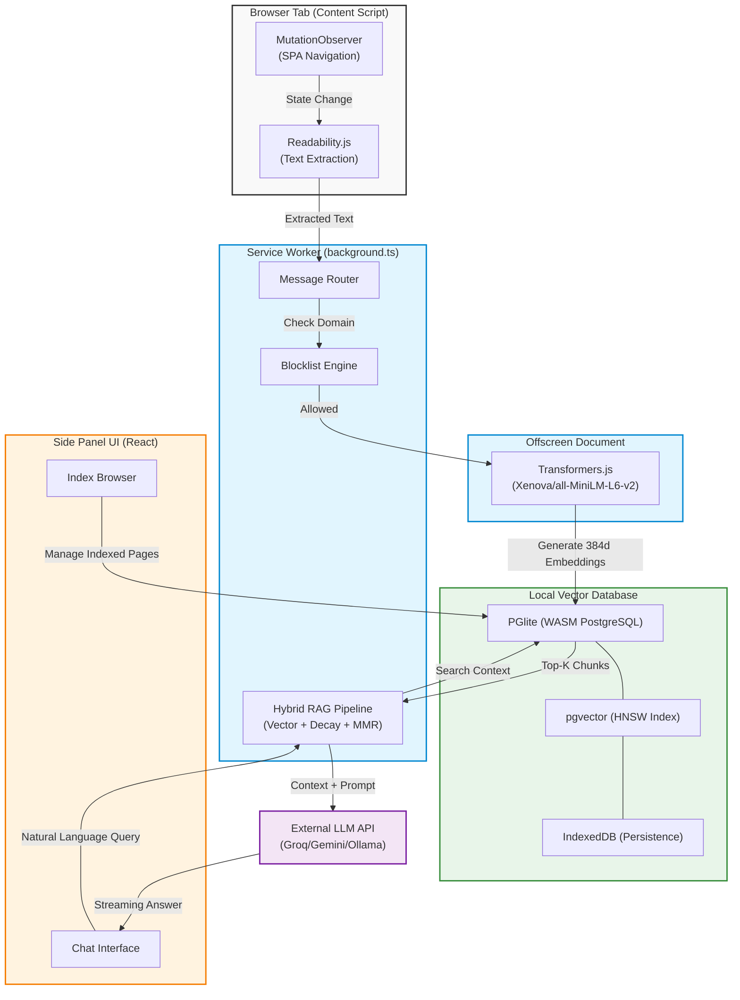

# 🧠 Second Brain — Local AI Browsing Assistant

[](https://developer.chrome.com/docs/extensions/mv3/)
[](#privacy-model)
[](https://wxt.dev)
[](#tech-stack)

**🎥 [Watch the Demo Video (Google Drive)](https://drive.google.com/file/d/1SXsY-3zHm0H4YOfWWA3mFMvLdaxoDk51/view?usp=sharing)**

Second Brain is a privacy-first Chrome Extension that builds a local Retrieval-Augmented Generation (RAG) pipeline over your browsing history. It passively indexes pages you visit using in-browser vector embeddings and a local WebAssembly Postgres database, then lets you ask natural-language questions about anything you've read — all without your data leaving your device.

## Features

- **100% Local Capture & Embedding**: Page text is captured via content scripts, cleaned with Readability.js, chunked, and embedded entirely in-browser using Transformers.js (`Xenova/all-MiniLM-L6-v2` ONNX model).
- **WebAssembly PostgreSQL**: Uses PGLite with `pgvector` to run a fully functional vector database directly in the browser via IndexedDB. Supports cosine similarity search, temporal filtering, and HNSW indexing.
- **Privacy-First Architecture**: Your browsing data never leaves your device. Only the final query + retrieved context chunks are sent to the LLM (Groq free tier by default) when you explicitly ask a question. See the Privacy Model section below.
- **Intelligent Deduplication**: SimHash (64-bit) fingerprinting with Hamming Distance comparison prevents re-indexing the same page content when you revisit or scroll.
- **Hybrid Retrieval**: Combines vector similarity, exponential time decay, MMR diversity re-ranking, document diversity enforcement, and negative rejection thresholds.
- **SPA Detection**: Monitors DOM mutations and `pushState`/`replaceState` navigation to capture content from Single Page Applications.
- **Background Backfill**: Instantly indexes your recent Chrome history (up to 200 pages, 14 days back) upon first install using the Chrome History API.
- **Multi-Provider LLM Support**: Groq (free tier), Google Gemini, or Ollama (fully local) — configurable from the Settings panel.

## Installation & Setup

1. **Clone the repository:**

   ```bash
   git clone https://github.com/HarshalAndhale9657/SecondBrain.git
   cd SecondBrain
   ```

2. **Install dependencies:**

   ```bash
   npm install
   ```

3. **Set up environment (optional — for build-time Groq key):**

   ```bash
   cp .env.example .env
   # Edit .env and add your VITE_GROQ_API_KEY
   ```

4. **Build the extension:**

   ```bash
   npm run build
   ```

5. **Load into Chrome:**
   - Navigate to `chrome://extensions/`
   - Enable **Developer mode** (top right toggle)
   - Click **Load unpacked** → select the `.output/chrome-mv3` folder

6. **Configure your LLM:**
   - Click the extension icon → open the Side Panel
   - Go to the **Settings** tab
   - Select your LLM provider and enter your API key
   - Groq free tier: get a key at [console.groq.com](https://console.groq.com)

## Usage

| Action       | How                                                                                                              |
| ------------ | ---------------------------------------------------------------------------------------------------------------- |
| **Capture**  | Just browse. Pages are automatically captured, cleaned, chunked, and embedded in the background.                 |
| **Ask**      | Open the Side Panel → type questions like "What was that article about PyTorch?" or "What did I read yesterday?" |
| **Review**   | **Index** tab shows all indexed pages with search/filter. Click any entry to open the original URL.              |
| **Privacy**  | **Settings** tab → add domains to blocklist, pause capture, or wipe the entire index.                            |
| **Backfill** | **Settings** → "Run Backfill" to index your Chrome history from the last 14 days.                                |

## Running the Evaluation

### One-Command Eval (Browser-Based)

1. Build and load the extension (steps above)
2. Open the extension **Side Panel** → go to **Settings** → click **Open Eval Runner**
3. Upload `eval/questions.json` and click **Run Evaluation**
4. The runner executes all 30 questions against your live IndexedDB, then downloads `eval-logs-output.json`

### Pre-Built Eval Logs

The repository includes pre-scored evaluation logs in `eval/logs/`:

- `eval-run-baseline.json` — Per-question results with retrieved chunks, scores, and diagnostic notes
- `summary.json` — Aggregated metrics by topology (direct, multi-hop, time-scoped, negative)

### Unit Tests

```bash
npx vitest run
```

Runs pipeline unit tests for chunking, SimHash deduplication, time parsing, and PGlite vector search.

## Privacy Model

### Core Principle: Local-First

The extension is designed so that **all data capture, storage, and retrieval happens entirely on your device**. The only external communication is the LLM API call (which only happens when you explicitly ask a question).

### Data Inventory

| Data Type                              | Stored Where                 | Leaves Device?                  |
| -------------------------------------- | ---------------------------- | ------------------------------- |
| Page text content (captured & chunked) | PGlite → IndexedDB           | ❌ Never                        |
| Vector embeddings (384-dimensional)    | PGlite → IndexedDB           | ❌ Never                        |
| SimHash fingerprints                   | PGlite → IndexedDB           | ❌ Never                        |
| Document URLs, titles, timestamps      | PGlite → IndexedDB           | ❌ Never                        |
| Blocklist configuration                | chrome.storage.local         | ❌ Never                        |
| Query + top-5 context chunks           | LLM API (Groq/Gemini/Ollama) | ⚠️ Only when you ask a question |

### What Is Never Captured

The extension ships with a **default blocklist** that prevents indexing of sensitive domains:

- **Banking & Finance**: PayPal, Chase, Wells Fargo, Bank of America, Citi + wildcard `*.bank.*`, `*.banking.*`
- **Email**: Gmail, Outlook, Yahoo Mail, Proton Mail
- **Healthcare**: MyChart, `*.health.*`, `*.patient.*`, `*.medical.*`
- **Messaging**: WhatsApp Web, Telegram, Discord, Google Messages
- **Password Managers**: Bitwarden, 1Password, LastPass
- **Sensitive URL Paths**: Any URL containing `/login`, `/signin`, `/password`, `/oauth`, `/checkout`, `/payment`, `/billing`, `/admin`

Users can add additional domains via the Settings panel.

### Threat Vectors Considered

1. **LLM Provider Data Access**: When using Groq or Gemini, context chunks are sent to their API. Use Ollama for fully offline, zero-leakage operation.
2. **Extension Update Compromise**: A malicious update could exfiltrate IndexedDB. Mitigated by strict CSP (`script-src 'self' 'wasm-unsafe-eval'`) and minimal permissions.
3. **Cross-Extension Access**: Chrome's IndexedDB is origin-scoped per extension — other extensions cannot read our data.
4. **Physical Device Access**: Same threat model as browser history itself. Users can wipe the entire index with one click.

### Embedding Irreversibility

The 384-dimensional embeddings stored in the database **cannot be reversed to reconstruct the original text**. Even if the vector database were exfiltrated, the embeddings alone reveal only semantic similarity, not content.

## Architecture



## Tech Stack

| Component          | Technology                                  |
| ------------------ | ------------------------------------------- |
| Framework          | WXT (Web Extension Toolkit)                 |
| UI                 | React + TypeScript                          |
| Build              | Vite 6.x                                    |
| Database           | PGlite (PostgreSQL WASM) + pgvector         |
| Embeddings         | Transformers.js (ONNX Runtime WASM)         |
| LLM                | Groq / Google Gemini / Ollama               |
| Content Extraction | Readability.js + custom DOM walker          |
| Deduplication      | SimHash (64-bit BigInt)                     |
| Retrieval          | Hybrid vector search + MMR + temporal decay |

## License

MIT
